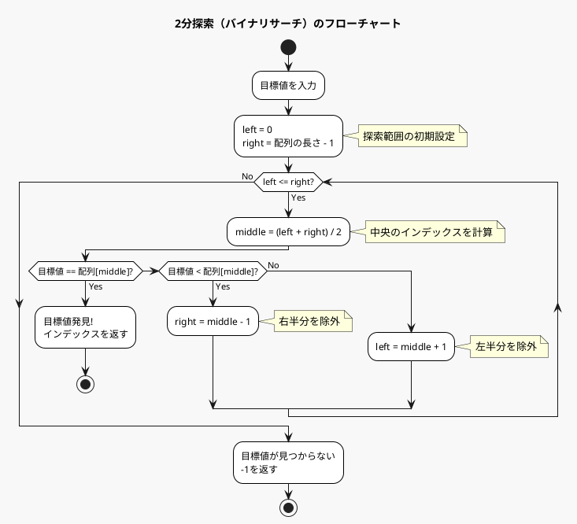

```plantuml
@startuml
skinparam backgroundColor #F8F8F8
skinparam activity {
    BackgroundColor white
    BorderColor black
    BorderThickness 1
}

title 2分探索（バイナリサーチ）のフローチャート

start
:目標値を入力;
:left = 0\nright = 配列の長さ - 1;
note right: 探索範囲の初期設定

while (left <= right?) is (Yes)
    :middle = (left + right) / 2;
    note right: 中央のインデックスを計算

    if (目標値 == 配列[middle]?) then (Yes)
        :目標値発見!\nインデックスを返す;
        stop
    elseif (目標値 < 配列[middle]?) then (Yes)
        :right = middle - 1;
        note right: 右半分を除外
    else (No)
        :left = middle + 1;
        note right: 左半分を除外
    endif
endwhile (No)

:目標値が見つからない\n-1を返す;
stop

@enduml
```
