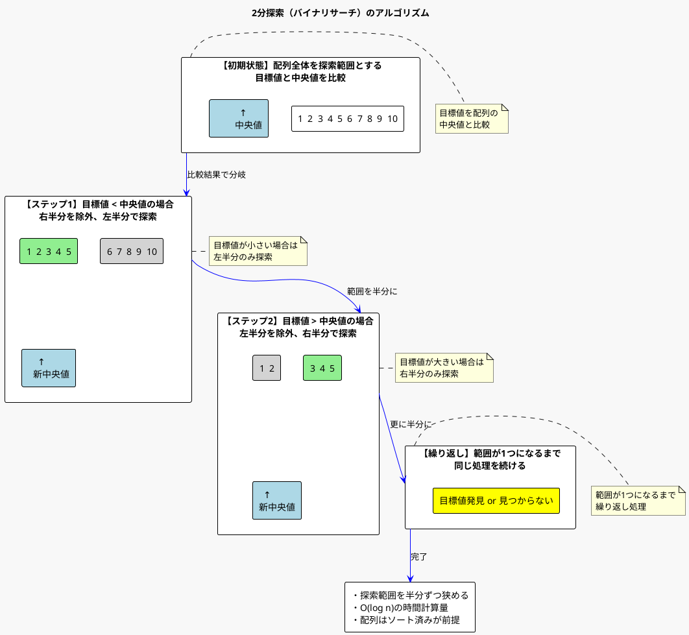

```plantuml
@startuml
skinparam backgroundColor #F8F8F8
skinparam rectangle {
    BackgroundColor white
    BorderColor black
    BorderThickness 1
}

title 2分探索（バイナリサーチ）のアルゴリズム

rectangle "【初期状態】配列全体を探索範囲とする\n目標値と中央値を比較" as step1 {
    rectangle "1  2  3  4  5  6  7  8  9  10" as array1
    rectangle "          ↑\n        中央値" as center1 #LightBlue
}

rectangle "【ステップ1】目標値 < 中央値の場合\n右半分を除外、左半分で探索" as step2 {
    rectangle "1  2  3  4  5" as array2_keep #LightGreen
    rectangle "6  7  8  9  10" as array2_remove #LightGray
    rectangle "    ↑\n  新中央値" as center2 #LightBlue
}

rectangle "【ステップ2】目標値 > 中央値の場合\n左半分を除外、右半分で探索" as step3 {
    rectangle "1  2" as array3_remove #LightGray
    rectangle "3  4  5" as array3_keep #LightGreen
    rectangle "  ↑\n新中央値" as center3 #LightBlue
}

rectangle "【繰り返し】範囲が1つになるまで\n同じ処理を続ける" as step4 {
    rectangle "目標値発見 or 見つからない" as result #Yellow
}

rectangle "・探索範囲を半分ずつ狭める\n・O(log n)の時間計算量\n・配列はソート済みが前提" as final

step1 -[#Blue]-> step2 : 比較結果で分岐
step2 -[#Blue]-> step3 : 範囲を半分に
step3 -[#Blue]-> step4 : 更に半分に
step4 -[#Blue]-> final : 完了

note right of step1 : 目標値を配列の\n中央値と比較
note right of step2 : 目標値が小さい場合は\n左半分のみ探索
note right of step3 : 目標値が大きい場合は\n右半分のみ探索
note right of step4 : 範囲が1つになるまで\n繰り返し処理

@enduml

```
