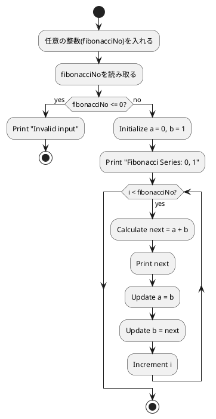

```plantuml
@startuml
start

:任意の整数(fibonacciNo)を入れる;
:fibonacciNoを読み取る;

if (fibonacciNo <= 0?) then (yes)
  :Print "Invalid input";
  stop
else (no)
  :Initialize a = 0, b = 1;
  :Print "Fibonacci Series: 0, 1";

  while (i < fibonacciNo?) is (yes)
    :Calculate next = a + b;
    :Print next;
    :Update a = b;
    :Update b = next;
    :Increment i;
  endwhile

  stop
endif
@enduml

```
